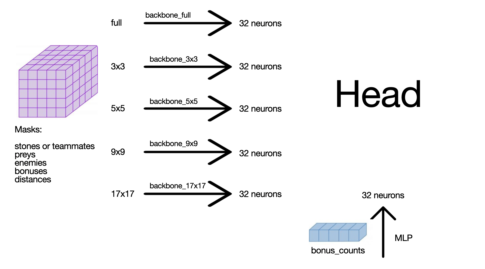
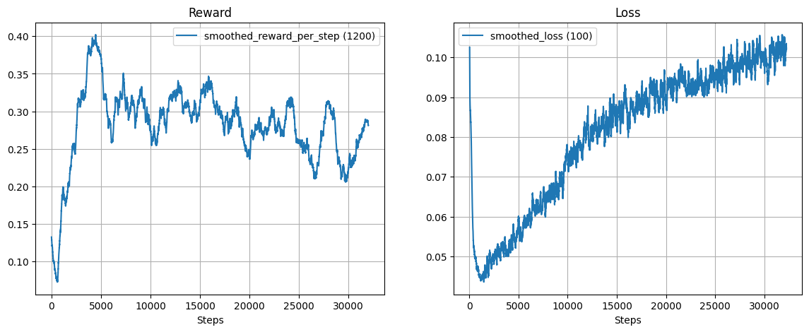
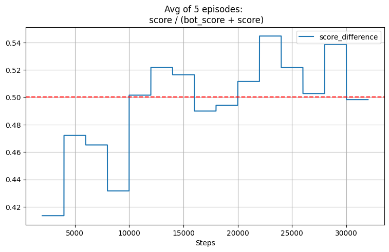
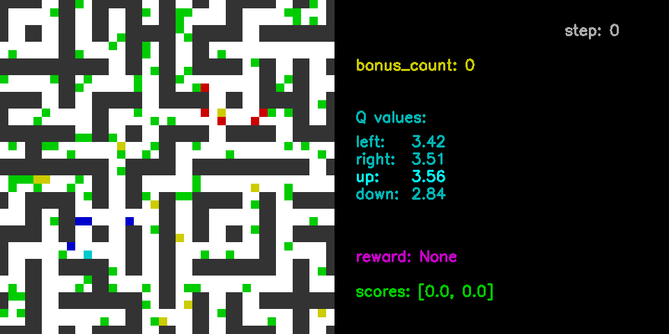
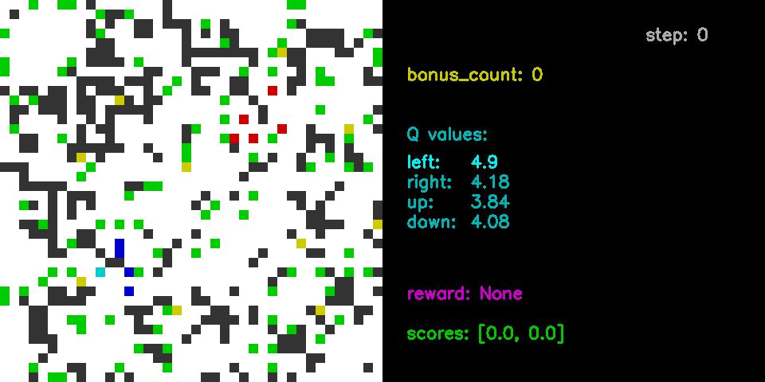

# Overview
This repository presents my solution to the Preys and Predators problem. (Environment description can be found in "ENV_DESC.md".)

Here I propose reward system, model architecture and the algorithm to train Deep Q-Network.

This model took **first place** in the competition among the course participants.

# Reward
First, in order to bring a human-like perspective to the problem, the **Target** cell is determined.

The n closest points of interest (preys/ enemies/ bonuses) are ranked by the following formula: 
$$TargetValue = TargetDensity / TargetDistance$$

TargetDensity displays the density of possible rewards in a certain area (11 cells in my experience) around the target with distance penalties (BFS).

The change in TargetDistance, as well as kills during the step, is used for Reward calculation:

$$Reward = \Delta TargetDistance \cdot W_{td} + \sum_{\substack{prey \\ enemy \\ bonus}} kill_{essence} \cdot W_{kill\_essence}$$

Then several corrections are applied:
- set $\Delta TargetDistance$ to 0 if $|\Delta TargetDistance| > 2$ (this may happen due to respawns or when the target is killed by another predator)
- set $\Delta TargetDistance$ to 0 if predator killed someone (prey/ enemy/ bonus)
- clip $\Delta TargetDistance$ to [-1, 1] because if $\Delta TargetDistance$ is -2 or 2, there is no agent's merit or fault here.
- punish for standing still

# Model
</img>

# Train
While training, the difficulty of generated maps gradually increases. Therefore, the reward decreases.

</img>
</img>

# Demo
</img>
</img>

# Competition scores

|       |     Name           |  Score | Score difference |
| ----- | ------------------ | ------ | ---------------- |
|   *1\.* |  *Ultimate Predator* | *0.8229* |    *23.5368*       |
|   **2\.** |   **Кольтюгин Максим (me)** | **0.7639** |    **19.1583**       |
|   *3\.* |             *Greedy* | *0.6959* |    *15.1199*       |
|   4\. |   Владимир | 0.6908 |    11.4924       |
|   5\. |        Илья | 0.6191 |     8.6699       |
|   6\. |   Мария | 0.6188 |    15.5250       |
|   7\. | Камилла | 0.6081 |     9.5909       |
|   8\. |    Алексей | 0.6068 |     9.1523       |
|   *9\.* |    *Lazy and Greedy* | *0.5838* |     *9.4534*       |
|  10\. |    Даниил | 0.5757 |     4.2615       |
|  11\. |   Артемий | 0.5613 |     6.1116       |
|  12\. |     Роман | 0.5500 |     7.2298       |
|  13\. |      Михаил | 0.5372 |     5.9804       |
|  14\. |    Борис | 0.4689 |     3.8818       |
|  15\. |        Юлия | 0.4270 |    \-1.1892      |
|  16\. |    Денис | 0.3500 |    \-8.6899      |
|  17\. |    Полина | 0.3408 |    \-4.4408      |
|  18\. | Анастасия | 0.3282 |   \-17.7676      |
|  19\. |       Оксана | 0.3187 |    \-6.2800      |
| *20\.* |              *Dummy* | *0.3112* |   *\-25.8091*      |
|  21\. | Юлиана | 0.2973 |   \-12.5693      |
|  22\. | Анастасия | 0.2726 |   \-39.6265      |

* *Ultimate Predator, Greedy, Lazy and Greedy, Dummy* are the **scripted agents**.
* Surnames of other participants were removed.